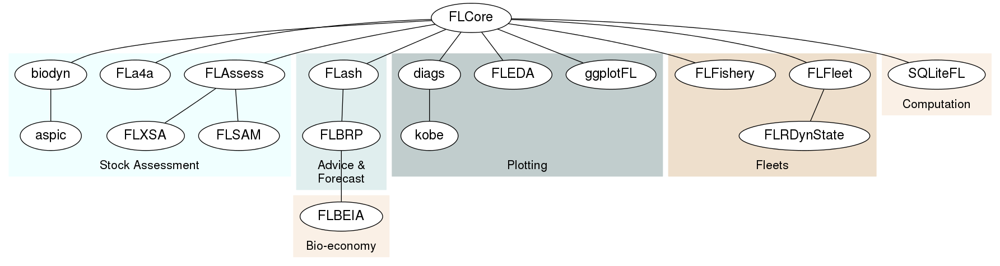
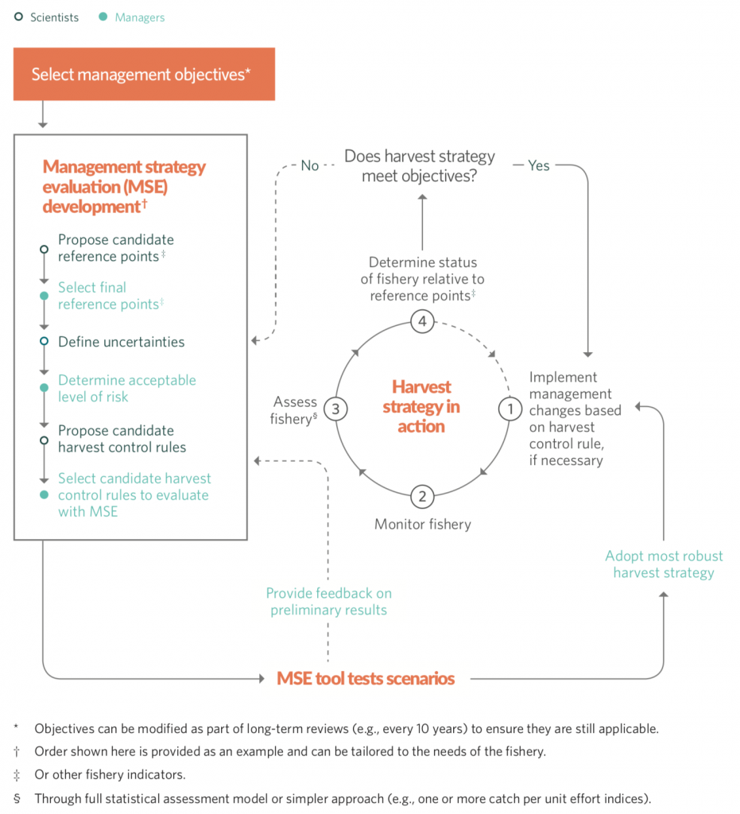
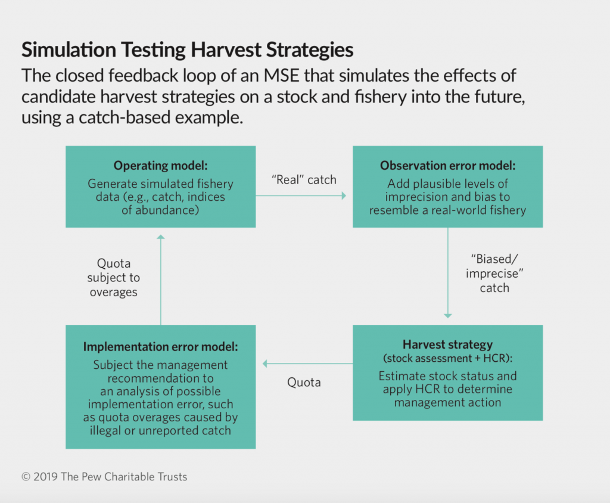
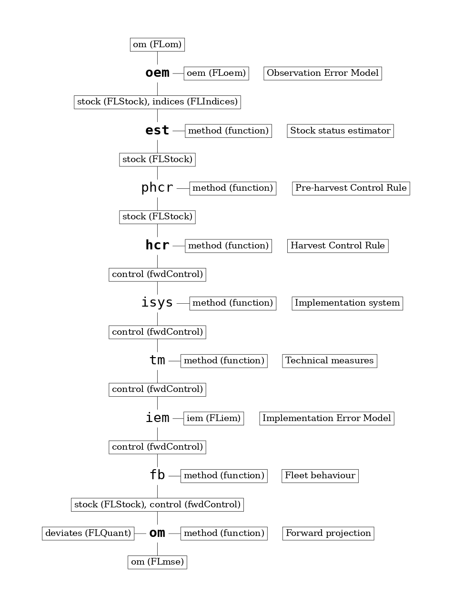

<style>
  pre {
    font-size: 15px;
  }
</style>


```{r setup, echo=FALSE, result="hide"}
library(knitr)
opts_chunk$set(echo=FALSE)
library(mse)
```

## Installing and updating packages.

```{r eval=FALSE, echo=TRUE}
install.packages(c("mse", "mseviz"), repos=c(FLR="https://flr.r-universe.dev"),
  CRAN="https://cloud.r-project.org/")
```

## A very quick introduction to FLR.

- Set of R packages

<div class="centered">
```{r}

```
</div>

- Project to develop them <https://flr-project.org>
- A Domain-specific language for fisheries science
- Open source, based on R, C++, TMB.
- Tool to apply the MS/MP/HS paradigm to fisheries

## What are Management Procedures

<div class="centered">
```{r}

```
</div>

- <https://harveststrategies.org/what-are-harvest-strategies/>

## MSE in a nutshell

- A process by which alternative MPs are tested and compared

<div class="centered">
```{r}

```
</div>

- <https://harveststrategies.org/management-strategy-evaluation/>

## MSE elements

- Performance indicators, how do we measure success?
- System uncertainties, what do we know and what risks are there?
- Management procedure, how do we manage the (fishery) system?
  - Observation and data collection framework, `oem`.
  - Status estimation by stock assessment or indicator, `est`.
  - Harvest Control Rule, `hcr`.
  - Implementation system, `isys`.

## MSE in FLR

<div class="centered">
```{r, out.width='42%'}

```
</div>

## Training material

- <https://git.wur.nl/mosqu003/flr-tutorials>
- `00 - Introduction and setup. Dissecting an example`

## Example: MSE analysis of recovery plans for ICES stocks

- <https://github.com/ices-tools-prod/WKREBUILD_toolset>
- Set up as a TAF repository
  - Conditioning an operating model, `data.R`
  - Evaluating alternative advice rules, `model.R`
  - Comparing performance across candidate rules, `output.R`
  - Reporting and communicating `report.R`


