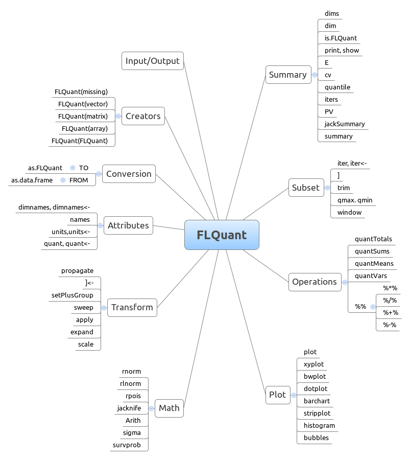
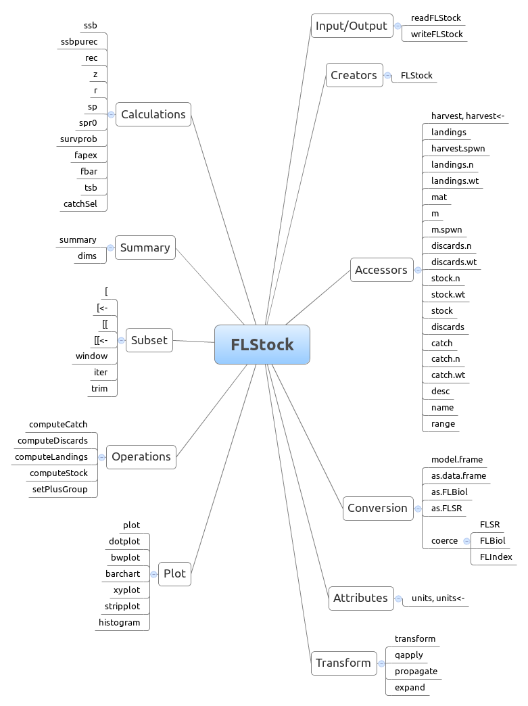
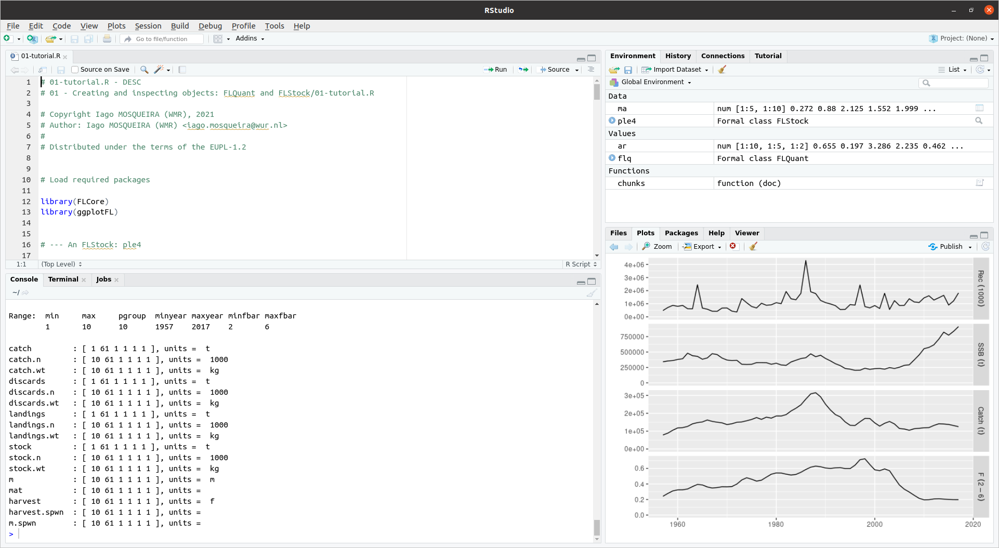

<style>
  pre {
    font-size: 15px;
  }
</style>


```{r setup, echo=FALSE, result="hide"}
library(knitr)
library(FLCore)
library(ggplotFL)
data(ple4)
opts_chunk$set(echo=FALSE)
```

## An FLStock: ple4

FLR class for our perception of the stock.

<div class="centered">
```{r plot}
plot(ple4)
```
</div>


## FLStock: slots

```{r summary, echo=TRUE}
summary(ple4)
```

## FLStock: slots

- Metadata: `name`, `desc`, `range`.
- Catch/landings/discards data:
    - `catch`, `catch.n`, `catch.wt`
    - `landings`, `landings.n`, `landings.wt`
    - `discards`, `discards.n`, `discards.wt`
- Biology: `mat`, `m`, `m.spwn`
- Population: `stock`, `stock.n`, `stock.wt`
- Exploitation: `harvest`, `harvest.spwn`

## FLStocks: accessors

```{r, echo=TRUE}
catch(ple4)
```
- AVOID using `ple4@catch`, as classes could change.

## FLStocks: replacement

```{r, echo=TRUE}
catch(ple4) <- landings(ple4) + discards(ple4)
```
- AVOID using `ple4@catch <-`, replacement method checks validity.


## FLStocks: methods

$$ SSB = N \cdot \exp(-(F \cdot S_{F} + M \cdot S_{M})) \cdot Wt \cdot Mat $$

`ssb = quantSums(stock.n * exp(-(harvest * harvest.spwn + m * m.spwn)) * stock.wt * mat)`

```{r, echo=TRUE}
ssb(ple4)
```

## FLStocks: more methods

```{r, eval=FALSE, echo=TRUE}
# Mean F (minfbar - maxfbar)
fbar(ple4)

# Recruitment
rec(ple4)

# Vulnerable biomass
vb(ple4)

# Year window
window(ple4, start=1970, end=1980)

# Subset
ple4[1:4, ac(1980:1990)]
```

## Help!

```{r, eval=FALSE, echo=TRUE}
help("FLStock")

?ssb
```
- FLCore help still incomplete.
- Cheatsheet being developed.

## FLQuant toolset

<div class="centered">
```{r}

```
</div>

## FLStock toolset

<div class="centered">
```{r}

```
</div>

## Tutorial

<div class="centered">
```{r}

```
</div>

## FLR classes

- FLQuant, FLPar, FLCohort: Building blocks.
- FLStock: Scientific perception of the stock.
- FLIndex, FLIndexBiomass: Indices of abundance, at age or in biomass.
- FLSR: Stock-recruitment relationship.
- FLlst: List of FLR objects (FLIndices).

## More information

- [FLR tutorials](https://flr-project.org/doc/index.html)
- [A quick introduction to FLR](https://flr-project.org/doc/A_quick_introduction_to_FLR.html)
- [Loading your data into FLR](https://flr-project.org/doc/Loading_your_data_into_FLR.html)
