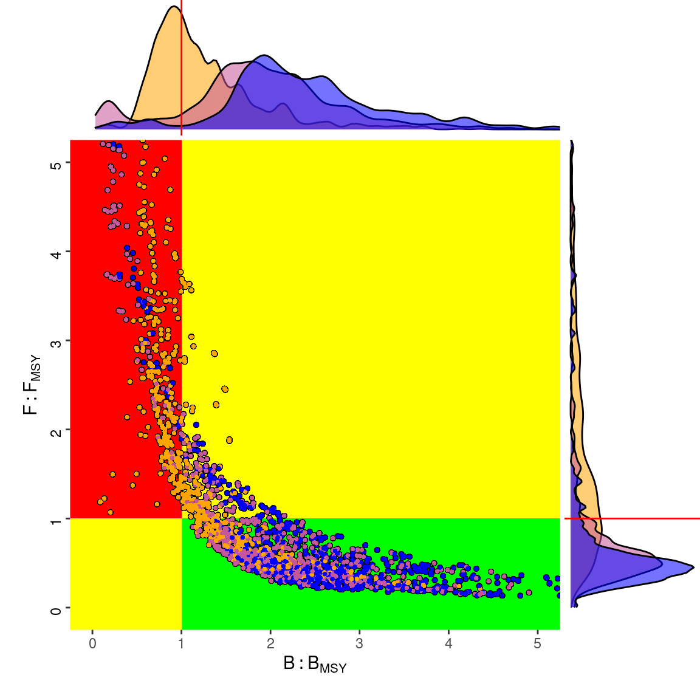

<style>
  pre {
    font-size: 15px;
  }
</style>


```{r setup, echo=FALSE, result="hide"}
library(knitr)
library(ggplotFL)
library(patchwork)
data(ple4)
opts_chunk$set(echo=FALSE)
```

## Make your own FLR ggplots

```{r}
mets <- FLQuants(`SSB (t)`=rlnorm(300, log(ssb(ple4)), 0.3),
  Catch=catch(ple4))

plot(mets) + geom_worm(data=lapply(mets, iter, 1:3)) +
  ggtitle("North sea plaice (ple.2740)") +
  annotate("rect", xmin = 2000, xmax = 2020, ymin = -Inf, ymax = Inf,
    fill = "#E69F00", alpha=0.1)
```

## ggplot2-based plot() - FLStock


```{r}
plot(ple4)
```

## FLQuant

```{r}
plot(ssb(ple4))
```

## FLQuants

```{r}
pgroup <- function(x) {
  return(stock.n(x)[dim(x)[1],])
}
plot(ple4, metrics=list(Recruits=rec, Plusgroup=pgroup))
```

## FLSR

```{r}
data(nsher)
plot(nsher)
```

## Customizing plot()

- Add elements: title, layers, facets, ...
- Change (most) elements: labels, colors, fonts, limits, ...

```{r}
plot(stock(ple4)) + ggtitle("Biomass ple.4.2740, AAP 2018") +
  geom_point() + ylab(expression(hat(B) (t))) +
  ylim(c(0,NA))
```


## ggplot

- Internal coertion to `data.frame`
- Remember conversion to data.frame for column names to use in `aes()`

```{r}
head(as.data.frame(catch.n(ple4)))
```

## geoms

- geoms are ways of plotting layers in ggplot, e.g. `geom_line`
- Some FLR specific geoms in ggplotFL
  - `geom_flquantiles`, for iter uncertainty
  - `geom_flpar`, for reference points
  - `geom_worm`, to add individual iters to a quantile plot

```{r, fig.width=8, fig.height=3}
flq <- rlnorm(300, log(catch(ple4)), 0.3)
refpts <- FLPar(FMSY=0.275, `F0.1`=0.155)

plot(flq) +
  (plot(fbar(ple4)) + geom_flpar(data=refpts, x=1952)) +
  (plot(flq) + geom_worm(data=iter(flq, c(1,67))))

```

## cohcorrplot

<div class="centered">
```{r, fig.height=10, fig.width=10, out.width="50%"}
cohcorrplot(stock.n(ple4))
```
</div>

## patchwork

- Combine ggplot objects in (almost) any way

<div class="centered">
```{r}
p1 <- ggplot(stock.wt(ple4), aes(x=age, y=data, group=year)) + geom_line() +
  facet_wrap(~(floor(year / 10) * 10)) + ylab("Weight in stock (kg)") + xlab("Age")

p2 <- ggplot(catch.wt(ple4), aes(x=age, y=data, group=year)) + geom_line() +
  facet_wrap(~(floor(year / 10) * 10)) + ylab("Weight in catch (kg)") + xlab("Age")

p3 <- plot(ple4, metrics=list(SSB=ssb, F=fbar))

( (p1 + p2) / p3 ) + plot_annotation(tag_levels = 'a')

```
</div>

## 03-tutorial.R

- ggplot reference <https://ggplot2.tidyverse.org/index.html>

<div class="centered">
```{r, out.width="50%"}

```
</div>
