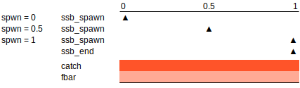

# 

<style>
  pre {
    font-size: 15px;
  }
</style>


```{r setup, echo=FALSE, result="hide"}
library(knitr)
library(FLasher)
library(ggplotFL)
data(ple4)
opts_chunk$set(echo=TRUE)
```


<div class="white">
Det er vanskeligt at spaa, især naar det gælder Fremtiden.

*It is difficult to make predictions, especially about the future.*

[Danish saying, commonly attributed to Niels Bohr](https://quoteinvestigator.com/2013/10/20/no-predict/)
</div>

<div class="centered">
```{r, echo=FALSE}

```
</div>


## FLasher::fwd(FLStock)

<div class="centered">
```{r, echo=FALSE, fig.height=7, fig.width=8, out.width="60%"}

fut <- stf(ple4, nyears=3, wts.nyears=3, fbar.nyears=3, disc.nyears=3)

srr <- predictModel(model=rec~a,
  params=FLPar(a=exp(mean(log(window(rec(ple4), end=-3))))))

control <- fwdControl(
  list(year=2018, quant="catch", value=112643),
  list(year=2019:2020, quant="fbar", value=0.21)
)

fmp <- window(fwd(fut, sr=srr, control=control), start=1990)

mets <- list(SSB=ssb, F=fbar)
rpts <- FLPars(SSB=FLPar(Blim=207288, Bpa=290203),
  F=FLPar(FMSY=0.21, Flim=0.516, Fpa=0.369))

plot(fmp, metrics=mets) + geom_flpar(data=rpts, x=1990) +
  labs(title="North sea plaice",
    subtitle=expression(list(C[2018] == TAC, F[2019-20] == F[MSY]))) +
  annotate("rect", xmin = 2018, xmax = 2020, ymin = -Inf, ymax = Inf,
    fill = "#E69F00", alpha=0.1)
```
</div>


## 1. Prepare for the future

- Future biology
  - Weights-at-age (`wt`)
  - Natural mortality (`m`)
  - Maturity (`mat`)
  - Timing of spawning (`m.spwn`)
  - Stock-recruits relationship (`srr`)

- Future fleet dynamics
  - Selectivity (`harvest`)
  - Discards ratio (`landings`, `discards`)
  - Timing of fishing (`harvest.spwn`)

## 2. Set targets and limits

- When (`year`, `season`)
- What (`quant`)
- How much (`value`)
- How much bigger / smaller (`relYear`)
- No smaller and/or larger than (`min`, `max`)
- FLStock targets
  - `f`, `fbar`
  - `ssb_spawn`, `ssb_end`, `biomass_spawn`, `biomass_end`
  - `ssb_flash`, `biomass_flash`
  - `catch`, `landings`, `discards`
  - `revenue`

## 3. Run projection

- `fwd()`
- FLStock + FLSR/predictModel + fwdControl
- Recruitment `deviances`, in log scale
- `maxF`, maximum Fbar by timestep, `maxF=4`
- FLQuant / FLQuants as control
  `fwd(..., fbar=FLQuant(0.21, dimnames=list(year=2018)))`

## A quick projection

```{r}
# SET future biology and fishery
fut <- stf(ple4, nyears=3)

# CONSTRUCT SRR
srr <- predictModel(model=rec~a, params=FLPar(a=966808, units="1000"))

# SET targets
control <- fwdControl(year=2018:2020, quant="fbar", value=0.21)

# RUN fwd
fsy <- fwd(fut, sr=srr, control=control)

# TEST and ...
compare(fsy, control)
```

## A quick projection

```{r}
# ... PROFIT!
```

<div class="centered">
```{r, echo=FALSE, fig.width=6}
plot(fsy, metrics=mets) + geom_flpar(data=rpts, x=1960) +
  ggtitle("North sea plaice (ple.2740) - STF 2018-2020") +
  annotate("rect", xmin = 2018, xmax = 2020, ymin = -Inf, ymax = Inf,
    fill = "#E69F00", alpha=0.1)
```
</div>


## Differences between FLash and FLasher

### fwdControl

- `quantity` is now `quant` 
- `val` is now `value`
- `rel` is now `relYear`

### Internal

- Solves for effort, not F
- `Fmax` as part of target list

### Seasonal and multiple units (sex)

### Multi-fishery and multi-stock

## Timing and targets

<div class="centered">
```{r, echo=FALSE, out.width="50%"}

```
</div>

### FLash

- `ssb` target if `spwn = 0` solved for following year.

### FLasher

- `ssb_spawn` to solve at `spwn`.
- `ssb_end` to solve at end of timestep.
- `ssb_flash` to solve as FLash did.

# <https://flr-project.org/FLasher>

<div class="centered">
```{r, echo=FALSE, out.width="50%"}

```
</div>
